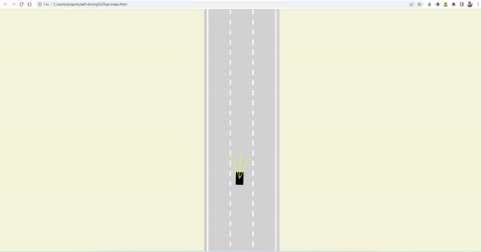
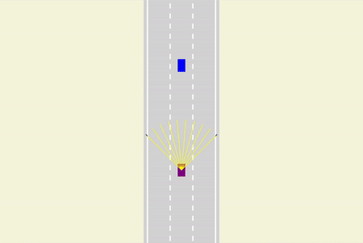
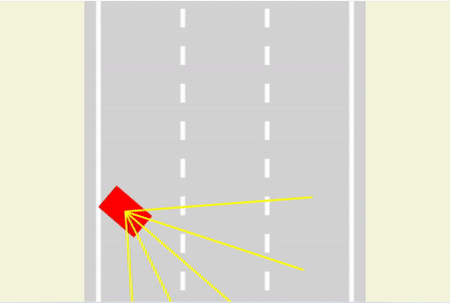
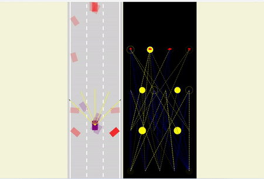
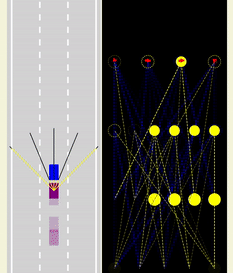

# Self-driving-car
Personal project: self-driving 2-d car with a neural network visualizer.

## Base model: 
implementing the car, controls, road, sensor and the canvas.

## 1st milestone : collision detection
- Use segment intersection to detect the road borders and other objects
- Detect collision against the car's geometric segments and other objects 
- Create dummy cars to represent random traffic 

## 2nd milestone: build neural network 
- Build neural network class that consists of different feed-forward levels
- Use the class and bind the sensors readings as inputs to the first level of the network
- Add "autopilot" control type to the controls class.
- The network starts by giving random weights and biases, and consequently make random moves that cause the car to crash.
- This problem can be fixed with parallelization ie having many instances of the car and a lot of scenarios. 

### Next step: build Neural Network Visualizer
- Create a new canvas to demenstrate how the network functions
- Build visualizer class that draws a given network on specified canvas
- It has 2 main functions :  1 drawLevel : draws specified level of the network: inputs , outputs, weights, biases. 
                            2 drawNetwork: uses drawLevel iteratively to draw the whole network.

## 3rd milestone: Parallelization, mutation, and some tuning.
- Create a lot of instances of the car object (eg 1000) all with random neural networks.
- Add a selective function that selects the optimal neural network based on the fitting function of how much further the car went in the y-axis direction.
- Create a function that saves a JSON object of the optimal neural network.
- Add mutation function to the neural network class, so you can mutate by a random yet ranged amount both the weights and biases of the network.
- Whenever you get a better performing network, save it until you reach a model that knows how to avoid collisions.

==> Parallelization & Mutation
 
  

## 4th milestone: Final touches and testing.
- Design car png picture and then generate random colors for traffic cars using masking technique.
- generate more cars in traffic as more testing to our model. 
- fix lable issue in the neural network visualizer. 
- Add save and destroy buttons to enable storing the autopilot(neural network). 

 
