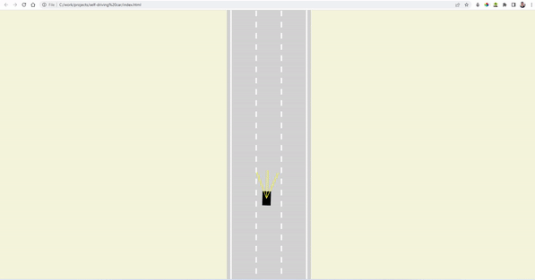
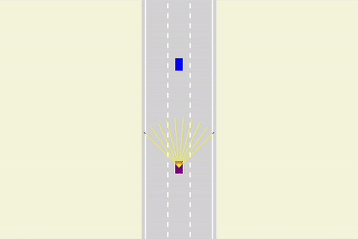
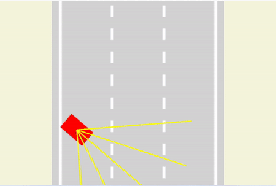
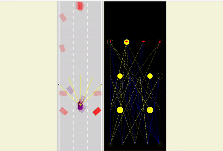
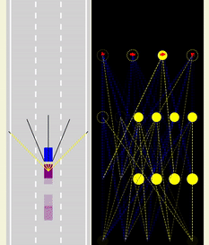

# Self-driving-car
Personal project: self-driving 2-d car with a neural network visualizer.

**Live demo:** https://3bdrahman.github.io/Self-driving-car/

## Current State (v2.0 - Genetic Algorithm + Fitness Shaping)

### Features Implemented

**Neural Network & Evolution:**
- Feed-forward network (9 sensor inputs → 6 hidden → 4 binary outputs: forward, left, right, backwards)
- 300 parallel cars per generation with mutation (rate 0.35)
- Fitness-based selection (pick MAX fitness from alive cars)
- Best brain saved to `localStorage` (survives reload), loaded on startup

**Sensors:**
- 9 rays, ±67.5° spread, 300px range — covers adjacent lanes
- Reads distance to road borders + traffic cars

**Physics:**
- Acceleration: 0.2/frame, friction: 0.05, maxSpeed: 7 (autopilot), 5.5 (traffic)
- Steering: 0.15 rad/frame (pulse to change lanes, hold = spin)
- Exclusive steering: left+right simultaneously → straight (prevents flicker)

**Traffic System:**
- Continuous spawner (target 50 cars, gap 200px, cull behind +1500px)
- 4 speed tiers: crawlers (1.0-1.8), normal (2.0-3.0), fast (3.0-4.0), speeders (4.0-5.5)
- Random lanes, random speeds — forces autopilot to weave

**Fitness Function (MAX = better):**
```
distance = -y                              // forward progress
+ 50 * laneChanges                          // each lane transition
+ 2 * highSpeedFrames (speed > 3.0)
+ 4 * maxSpeedFrames (speed > 95% max)
- 12 * brakeFrames (backwards while moving)
- 0.15 * sameLaneFrames (grows while stuck in one lane)
- 30 * stopFrames (|speed| < 0.3)
- 50 * backwardsFrames (speed < -0.1)
- 0.5 * anglePenaltyFrames (Σ|angle| — punishes circles/spins)
```

**Controls:**
- `Save` — stores best brain to localStorage
- `Destroy` — clears localStorage (reset brain)
- Keys: Arrow keys for manual control

## Architecture

| File | Purpose |
|------|---------|
| `main.js` | Simulation loop, traffic spawner, fitness, selection |
| `car.js` | Physics, controls, sensors, neural net integration |
| `sensor.js` | 9-ray sensor system (135° spread, 300px) |
| `network.js` | Feed-forward NN with mutation |
| `networkVisualizer.js` | Real-time NN visualization |
| `road.js` | Road borders, lane centers |
| `controls.js` | Keyboard + autopilot controls |

## How to Run

```bash
# Option 1: Open directly in browser
open index.html

# Option 2: Local server (recommended for Firefox/Chrome)
python3 -m http.server 8000
# Then open http://localhost:8000
```

**Clear old brain before testing changes:** Open DevTools → Application → Local Storage → delete `bestAutopilot` key.

## Training Behavior

The GA converges on: **full throttle + sharp lane-change pulses + zero braking + minimal angle**. Cars that stick to one lane, brake, stop, reverse, or spin get heavily penalized.

## Future Recommendations

- Add curves to lanes
- Implement explicit generational resets (every N frames)
- Traffic cars with basic lane-change AI
- Multi-objective fitness (Pareto front: speed vs safety vs lane discipline)
- Export trained brain for replay/analysis

---

## Milestones (Original)

### Base model
Implementing the car, controls, road, sensor and the canvas.


### 1st milestone: collision detection
- Segment intersection for road borders and objects
- Geometric collision detection
- Dummy cars for traffic


### 2nd milestone: neural network
- Feed-forward NN class with levels
- Sensors as inputs, autopilot control type
- Random weights → random crashes
- Parallelization solves it


### 3rd milestone: Neural Network Visualizer
- Canvas visualization of network
- drawLevel / drawNetwork functions


### 4th milestone: Parallelization, mutation, tuning
- 1000+ parallel cars with random networks
- Selection by y-distance fitness
- Save/load best brain as JSON
- Mutation function for weights/biases
 

### 5th milestone: Final touches
- Car PNG + random color masking for traffic
- More traffic cars
- Fix visualizer labels
- Save/destroy buttons


---

**Note:** Use Firefox for best performance. Download the project for smoother animations.